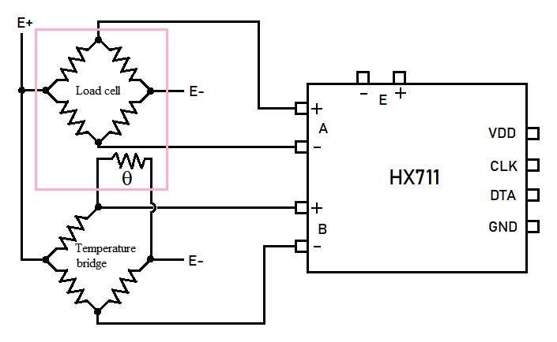

## Forward power measurement for swimming strokes

It is a common work-out type to use rubber cord resistance swimming for creating explosive power. In this work-out the swimmer wears a belt 
with either a bare rubber cord or a common bungee cord material.

For safety reasons the commercial rubber cords have an internal safety string in the event of cord breakage. 
The textile sheath of a bungee cord serves the same purpose. It is important to use a cord material which has higher maximum resistance 
than what the swimmer can produce so that the cord does not bottom out during the exercise.

If the other end of the rubber cord is attached to a load weighing device, the power output of swimmer can be measured. There are several types of commercial scales
which can be used for this purpose, like luggage scales and fisherman’s scales. Often, they have a display memory, which locks when the reading is stabilized.
For a work-out this is not desirable because the swimmer may add power when his/her speed wears out.

For my testing device I used the body of a commercial fisherman’s scale. It was not very expensive but the most important part, the load cell was very sturdy and 
reliably mounted. I also spared the casing with the handle and the push button PCB inside the unit.

Several tutorials exist of Arduino based weighing systems using the weighing cell amplifier HX711. Both these were soldered on a perf board and fitted inside the case.

In my first version, I used the load cell as such. In the initial tests I quickly noticed that the weight readings fluctuated with time. I suspected temperature drift, 
and this was proven true. The self-heating of the load cell may have been a big factor.

Fortunately, the HX711 breakout board has two channels, but there were no public examples of how to utilize them both in the same project.
The HX711 datasheet hinted that the magic related to the amplification setting. 
If you set the amplification to 32, the channel B is activated and the two other options 64 and 128 are associated with channel A.

There were no examples of temperature measurement with HX711, but since the channel B accepts differential DC signals, I did not hesitate to give it a try.

A load cell has very small output voltage and although channel B has 4 times lower sensitivity, the temperature cell output needed to be damped considerably.

I used a 1500 ohm NTC thermistor and a 47 kohm current limiting resistor in a measuring bridge. In the reference path I used fixed resistors 
of corresponding values. Even then the temperature bridge ADC output was about 1000000 units per degC!

Finally, the temperature dependence needed to be calibrated. I plotted channel A and B readings with time. The plot was very linear, and the correction factor
was calculated and implemented in the measurement formula in the Arduino code. Therefore, the Arduino always delivers temperature compensated results.

The testing process was refined at the pool, and it was clear that the current Python code needed some kind of stopping signal.
Since at that stage I was holding the power cell, most straightforward solution was to send the signal with the Arduino data stream.
Luckily the scale had originally three push buttons for power and setups. I used the center button to act as a Stop button.

A secondary use for the button push was to refresh the temperature reading for the temperature correction. I always push the Stop button just before starting the test. 
It certainly could be done automatically by including the necessary function in the Python code.

